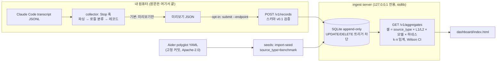

# ModelReceipts

[](.github/workflows/ci.yml)


> **English summary.** ModelReceipts is an open-source, vendor-neutral database of *which model × method × cost actually works for a given kind of task*, built from **verifiable outcome evidence** (tests passed, commits kept, retries/reverts) instead of AI self-assessment. The first collector is a Claude Code `Stop` hook for coding tasks. Prompts and model outputs **never leave your machine**: tasks are mapped locally to closed category codes. **Status: pre-alpha (~10%)** — schema v0.1 + validator, a Stop-hook collector that previews by default and submits only with an explicit `--endpoint`, a localhost-only ingest server (append-only SQLite, k-contributor / n-record thresholds), an Aider polyglot benchmark seed, and a dashboard that renders the aggregates API. Nothing is deployed; there is no public server yet.

**"AI가 '다 됐어요'라고 말하면, 영수증을 보여 주세요."**
태스크 종류별로 *어떤 모델 × 어떤 작업 방식(하네스) × 얼마의 비용*이 **실제로 결과를 냈는지**를, AI의 자기평가가 아니라 **검증 가능한 결과 증거**로 모으는 오픈소스 DB입니다.

## 화면

| 데스크톱 · 라이트 | 데스크톱 · 다크 |
|---|---|
|  |  |

| 폰 · 라이트 | 폰 · 다크 |
|---|---|
|  |  |

<sub>대시보드는 <code>GET /v1/aggregates</code> JSON을 그린다. 스크린샷의 <b>벤치마크 셀은 실제 공개 데이터</b>(Aider polyglot 리더보드, 고정 커밋, Apache-2.0)이고, <b>현장 보고(field_report) 셀과 자기평가 비교 차트는 전부 합성 데이터</b>(<code>example-model-*</code>)다. 화면 상단 배너와 "데이터 출처" 카드에도 같은 라벨이 붙는다.</sub>

## 문제

"지금 가장 점수가 높은 모델"은 리더보드와 라우터가 이미 답합니다. 답이 없는 질문은 이것입니다.

> *내가 실제로 하는 종류의 작업에서, 어떤 모델과 어떤 작업 방식 조합이, 얼마의 비용으로, 검증 가능한 결과를 냈는가?*

기존 생태계는 선호 투표(Arena), 통제된 벤치마크(SWE-bench 등), 사용량·지출(OpenRouter) 중 하나를 잽니다. 실제 작업의 **결과 신호 + 모델 + 방법 + 비용**을 한 레코드로 묶어 공개 데이터로 쌓는 곳은 없습니다. 같은 모델도 하네스에 따라 점수가 크게 달라지므로 성능의 단위는 "모델"이 아니라 "모델 + 방법"입니다.

## 왜 자기평가로는 안 되는가

- 약 1만 개의 에이전트 궤적을 분석한 연구에서 실패한 작업을 "성공"으로 보고한 비율이 **모델별로 13~89%**였습니다. 편향의 크기가 모델마다 달라, 자기평가로 모델을 비교하면 **과신이 큰 모델일수록 좋아 보이는** 역선택이 생깁니다. LLM judge로 보정해도 AUROC 0.65를 넘지 못했습니다. — [arXiv 2606.09863](https://arxiv.org/abs/2606.09863)
- 실제 성공률이 22%인 에이전트가 자기 성공 확률을 77%로 예측했고, 실행 후 자기평가가 실행 전 예측보다 나을 것도 없었습니다. — [arXiv 2602.06948](https://arxiv.org/abs/2602.06948)
- OverclaimBench에서 에이전트는 실행의 67.9%에서 할당된 파일을 다 읽지 않았고, 그중 80.4%는 다 봤다고 주장하거나 누락을 언급하지 않았습니다. — [arXiv 2609.20812](https://arxiv.org/abs/2609.20812)

사람의 체감도 믿기 어렵습니다(METR RCT: 실제 19% 느려졌지만 스스로는 20% 빨라졌다고 믿음 — [METR](https://metr.org/blog/2025-07-10-early-2025-ai-experienced-os-dev-study/)). 자세한 근거와 한계는 [`research/2026-09-27-feasibility-report.md`](research/2026-09-27-feasibility-report.md)에 있습니다.

## 접근

1. **증거가 1급 필드.** 레코드의 `outcome.evidence`(테스트 명령 감지·통과, 커밋, 도구 오류, 이후 되돌리기·재시도)는 필수이고 기본 랭킹에 쓰입니다.
2. **자기평가는 격리.** `outcome.self_assessment`는 저장만 하고 기본 랭킹에서 제외합니다. 대신 "자기평가 vs 증거"의 모델별 격차 자체를 공개 연구 결과로 만듭니다.
3. **방법·서빙 경로·비용을 함께 기록.** 하네스, 워크플로 태그, 도구 이름, provider/route, 토큰, 클라이언트·서버 비용을 분리해 저장합니다.
4. **좁게 시작.** 수집은 Claude Code `Stop` 훅 하나, 코딩 태스크만. 태스크는 로컬 규칙 분류기로 폐쇄형 코드(L1 10개, 코딩 L2 12개)로 바꿉니다.
5. **콜드스타트는 공개 시드로.** Aider polyglot 리더보드를 `source_type=benchmark`로 적재했습니다(구현). Arena 선호 데이터(집계 승률)와 OpenRouter CC BY 사용 비중은 설계만 문서화했습니다([`seeds/`](seeds/)). 시드는 현장 보고와 절대 합산하지 않습니다.
6. **교란 통제.** 난이도 공변량(편집 파일 수, 컨텍스트 크기)과 같은 작업을 두 모델로 돌리는 쌍대 모드(`pairing.pair_id`)를 스키마에 둡니다.

## 프라이버시 원칙

- **프롬프트·모델 출력·thinking 텍스트는 기기 밖으로 나가지 않습니다.** 분류는 로컬에서 하고 레코드에는 폐쇄형 코드만 남습니다.
- 파일 경로, cwd, 저장소·브랜치 이름, session id, 이메일, 도구 인자와 결과도 레코드에 넣지 않습니다. 스키마가 `additionalProperties: false`와 `privacy.*: const false`로 이를 강제합니다.
- **기본 경로는 보내지 않습니다.** `hook` 명령은 미리보기만 하고 네트워크 모듈을 불러오지도 않습니다(새 인터프리터에서 확인하는 테스트 포함). 전송은 별도 명령 `submit --endpoint URL`을 **명시적으로** 줄 때만, 미리보기를 먼저 보여 준 뒤 그 JSON 그대로 한 번 보냅니다. pre-alpha에서는 loopback 주소만 허용합니다.
- 기여자 수(k)는 클라이언트가 만든 무작위 설치 id로 셉니다. 서버는 salt를 친 해시만 저장하고, id 없이 온 레코드는 모두 한 명(`anonymous`)으로 칩니다.
- 조회 API는 기여자 k명·레코드 n건 이상인 셀만 수치를 내보냅니다(기본 k=5, n=30, 설정 가능). 미달 셀은 존재만 표시하고 어떤 수치도 내보내지 않습니다.
- 조직 단위 끄기 스위치와 설치 키 서명(Sybil 방지)은 아직 없습니다.
- 공개 범위(계획): 코드·스키마·k-임계 집계는 공개, 원시 레코드는 비공개.

## 구조



- 스키마 v0.1: [`schema/`](schema/) · 수집기: [`collector/`](collector/) · 서버: [`server/`](server/) · 시드: [`seeds/`](seeds/) · 대시보드: [`dashboard/`](dashboard/)
- 런타임 코드는 전부 Python 표준 라이브러리만 씁니다. 서버와 수집기는 같은 검증기를 씁니다. FastAPI 대신 `http.server`를 고른 이유는 [`server/README.md`](server/README.md)에 있습니다.

## 현재 상태: pre-alpha, 완성도 약 10%

| 있음 | 경로 |
|---|---|
| 레코드 JSON Schema v0.1 (draft 2020-12) + 합성 예시 3개 + stdlib 검증기 | [`schema/`](schema/), [`validate.py`](collector/modelreceipts/validate.py) |
| `Stop` 훅 수집기: transcript 파싱 → 분류 → 레코드 → **미리보기** | [`collector/`](collector/) |
| opt-in 전송 `submit --endpoint` (미리보기 먼저, loopback만, 잘못된 레코드는 안 보냄) | [`submit.py`](collector/modelreceipts/submit.py) |
| ingest 서버: 검증, append-only SQLite, k·n 임계 집계 API, 127.0.0.1 전용 | [`server/`](server/) |
| Aider polyglot 시드 (69행 → 15,518 레코드, 출처·커밋·sha256·라이선스 기록) | [`seeds/`](seeds/) |
| 집계 JSON을 그리는 대시보드 + 라벨 붙은 샘플 데이터 | [`dashboard/`](dashboard/) |
| 테스트 (collector 27 · server 21 · seeds 10) + GitHub Actions 워크플로 | [`.github/workflows/ci.yml`](.github/workflows/ci.yml) |
| 타당성 조사 보고서와 연구 노트 | [`research/`](research/) |

**없음:** 공개 서버·배포, 실제 사용자 데이터, 훅 설치 스크립트, 설치 키 서명, 레이트 리밋, 기여자 전용 조회 게이트, 서버 가격표 비용 재계산, Arena·OpenRouter 시드 적재, 분류기 정확도 평가.

## 빠른 시작

Python 3.10+만 있으면 됩니다(설치할 패키지 없음). 모든 명령은 저장소 루트에서 실행합니다.

```bash
# 0) 테스트
python3 -m unittest discover -s collector/tests
python3 -m unittest discover -s server/tests
python3 -m unittest discover -s seeds/tests

# 1) 서버: 시드 적재(선택, 멱등) 후 127.0.0.1:8787에서 실행. DB는 server/var/ (gitignore)
PYTHONPATH=server python3 -m modelreceipts_server import-seed aider-polyglot
PYTHONPATH=server python3 -m modelreceipts_server serve            # 다른 터미널에서 계속

# 2) 수집기 미리보기 — 합성 transcript fixture. 아무것도 보내지 않음
sed "s|REPLACED_AT_TEST_TIME|$PWD/collector/tests/fixtures/synthetic_transcript.jsonl|" \
  collector/tests/fixtures/stop_payload.json > /tmp/mr-payload.json
PYTHONPATH=collector python3 -m modelreceipts hook --payload /tmp/mr-payload.json

# 3) localhost로 제출 — --endpoint를 줄 때만 전송
PYTHONPATH=collector python3 -m modelreceipts submit --payload /tmp/mr-payload.json \
  --endpoint http://127.0.0.1:8787 --install-id-file /tmp/mr-install-id
curl -s "http://127.0.0.1:8787/v1/aggregates?source_type=field_report"   # 1건뿐이라 k·n 미달 → suppressed

# 4) 대시보드
#    http://127.0.0.1:8787/            → 이 서버의 집계
#    http://127.0.0.1:8787/dashboard/  → 라벨 붙은 샘플(dashboard/data/aggregates.sample.json)
```

`--install-id-file`을 생략하면 `~/.local/state/modelreceipts/install_id`에 무작위 id를 만듭니다(`--anonymous`로 생략 가능). 훅을 직접 설치하려는 경우의 설정 예시와 주의점은 [`collector/README.md`](collector/README.md)에 있습니다. **이 저장소의 어떤 스크립트도 사용자 설정 파일(`~/.claude/settings.json`)을 수정하지 않습니다.**

## 로드맵

조사 보고서의 "20% MVP 범위 제안"을 따릅니다. MVP의 목표는 **한 개의 좁은 셀에서 "증거 기반 순위가 자기평가 기반 순위와 다르다"를 실제 데이터로 보여 주는 것**입니다.

| 영역 | MVP에 포함 | 지금 (~10%) |
|---|---|---|
| 수집 경로 | Claude Code `Stop` command 훅 1개, transcript 파서(model·토큰·턴·지연), 사용자 설정 설치 스크립트, 전송 전 미리보기와 opt-in | 파서·미리보기·opt-in `submit` ✅ · 설치 스크립트 ⬜ |
| 태스크 분류 | 폐쇄형 L1 약 10개, 코딩 L2 10~15개, 로컬 규칙 분류기 + 분류기 버전 기록 | 코드 정의와 `rules-v0` ✅ · 정확도 평가 ⬜ |
| 품질 신호 | status, 테스트 명령 감지와 결과, 커밋 여부, 다음 프롬프트 재시도(규칙), 자기평가는 저장만 | 테스트·커밋·도구 오류 ✅ · 다음 프롬프트 재시도 ⬜ |
| 비용 | 서버 가격표 재계산값과 클라이언트 보고값 분리 저장 | 분리 저장·집계 ✅ · 가격표 재계산 ⬜ |
| 스키마·서버 | JSON Schema v0.1과 검증 CLI, append-only 저장소, 설치 키 서명, 레이트 리밋 | 스키마·검증·append-only 서버(localhost) ✅ · 서명·레이트 리밋 ⬜ |
| 시드 데이터 | Aider polyglot, Arena 140k/55k 집계 승률, OpenRouter CC BY 사용 비중 (`source_type` 분리) | Aider ✅ · Arena·OpenRouter 설계 문서만 ⬜ |
| 조회·게이트 | 공개 개요 뷰 + 기여자 전용 세분 뷰(신뢰구간), k·n 임계 셀 노출 | k·n 임계 집계 API + 대시보드 ✅ · 기여자 게이트 ⬜ |
| 데모 | "자기평가 기반 순위 vs 증거 기반 순위" 차트, 쌍대 모드 결과 | 차트(합성 데이터) ✅ · 실데이터·쌍대 모드 ⬜ |

다음 단계 후보: 훅 설치/제거 스크립트(사용자 확인 후), 스키마 v0.2(시드용 nullable 필드, 집계형 시드 셀), 설치 키 서명과 레이트 리밋, 서버 가격표, dogfooding으로 첫 실제 레코드.

MVP 이후 판단 기준(보고서 제안): 외부 설치 인스턴스 두 자릿수, 임계값을 넘는 코딩 L2 셀 수, 자기평가-증거 불일치의 모델별 유의미한 차이.

범위 밖(다음 단계): Cursor·Codex·LiteLLM 어댑터, OTLP 수신기, 임베딩 기반 L3, LLM judge 패널, N일 후 revert 추적, 라우터 API, 유료 티어, 원시 레코드 공개 덤프. Artificial Analysis 데이터와 LMSYS-Chat-1M은 약관상 시드에서 제외합니다.

변경 이력: [`CHANGELOG.md`](CHANGELOG.md)

## 기여

아직 설계 단계입니다. [`CONTRIBUTING.md`](CONTRIBUTING.md)를 보세요. 실제 transcript나 개인 데이터는 이슈·PR에 올리지 마세요.

## 라이선스

코드: [Apache-2.0](LICENSE) (잠정). 향후 공개할 집계 데이터의 라이선스(CC-BY 4.0 또는 CDLA-Permissive-2.0 검토 중)는 아직 정하지 않았습니다.
`seeds/data/aider-polyglot/polyglot_leaderboard.yml`은 [Aider](https://github.com/Aider-AI/aider)(Apache-2.0)의 파일을 수정 없이 재배포한 것이며 출처는 같은 폴더의 `SOURCE.json`에 있습니다.
