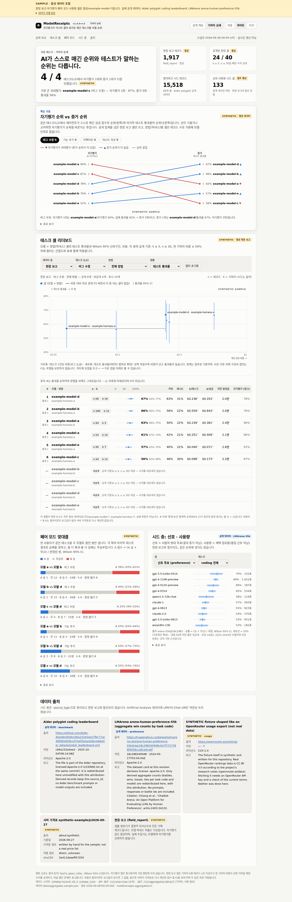
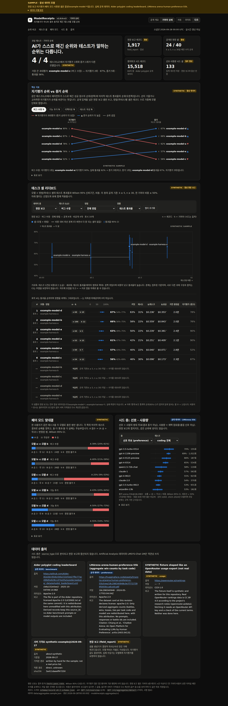
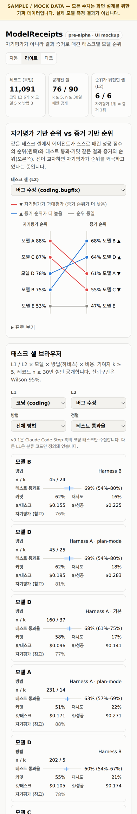
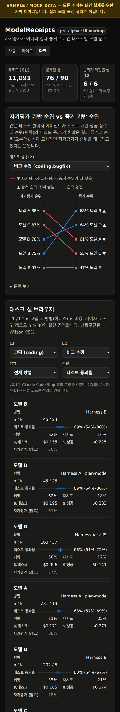
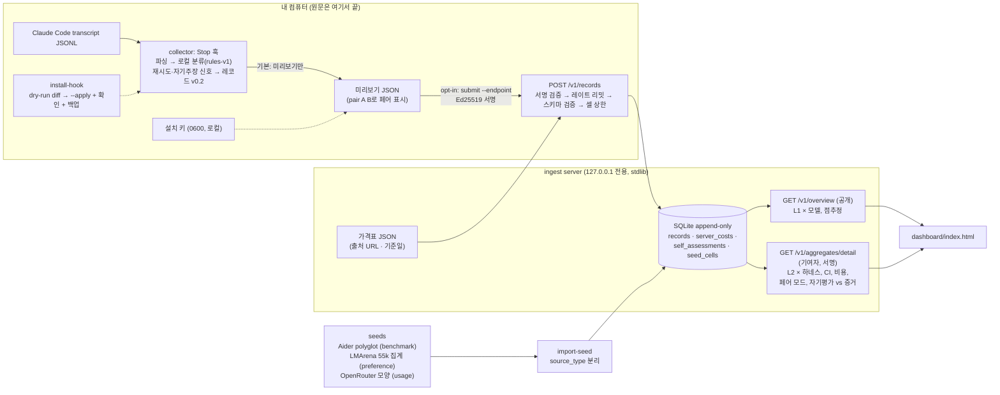

# ModelReceipts

[](.github/workflows/ci.yml)


> **English summary.** ModelReceipts is an open-source, vendor-neutral database of *which model × method × cost actually works for a given kind of task*, built from **verifiable outcome evidence** (tests passed, commits kept, next-prompt retries) instead of AI self-assessment. The first collector is a Claude Code `Stop` hook for coding tasks. Prompts and model outputs **never leave your machine**: tasks are mapped locally to closed category codes. **Status: v1.0.0-rc3, a code-complete candidate after a quality, security and design pass ([`docs/QUALITY.md`](docs/QUALITY.md)).** It includes:
>
> - schema v0.2 with a migration and a validation CLI
> - a Stop-hook collector that previews by default, and a hook installer that runs as a dry run first
> - opt-in submission, signed with Ed25519
> - a localhost-only ingest server: append-only SQLite, rate limits, server-side cost from a price table, k/n and dominance thresholds, a public overview and a contributor-only detail view, and pair mode
> - seed layers from Aider, LMArena-55k and an OpenRouter-shaped source
> - a dashboard
>
> **Nothing is deployed and there is no real user data yet.** Every field report shown is synthetic and labeled as such.

**"AI가 '다 됐어요'라고 말하면, 영수증을 보여 주세요."**
태스크 종류별로 *어떤 모델 × 어떤 작업 방식(하네스) × 얼마의 비용*이 **실제로 결과를 냈는지**를, AI의 자기평가가 아니라 **검증 가능한 결과 증거**로 모으는 오픈소스 DB입니다.

## 화면

| 데스크톱 · 라이트 | 데스크톱 · 다크 |
|---|---|
|  |  |

| 폰 · 라이트 | 폰 · 다크 |
|---|---|
|  |  |

<sub>대시보드는 <code>GET /v1/aggregates/detail</code>(기여자 상세)이나 <code>GET /v1/overview</code>(공개 개요)의 JSON을 그립니다. 스크린샷에서 <b>실제 공개 데이터</b>는 벤치마크 셀(Aider polyglot)과 선호 셀(LMArena 55k 집계)입니다. <b>전부 합성 데이터</b>(<code>example-model-*</code>)인 것은 현장 보고(field_report) 셀, 자기평가 비교, 페어 모드, 사용량(OpenRouter 모양) 셀입니다. 같은 라벨이 화면 상단 띠, 히어로·KPI, 카드의 SYNTHETIC 태그, 차트 안의 워터마크, "데이터 출처" 카드에 붙습니다. 화면 구성과 참고한 디자인 패턴은 <a href="docs/DESIGN_REFERENCES.md"><code>docs/DESIGN_REFERENCES.md</code></a>에 있습니다.</sub>

데모 그림(합성): [`docs/figures/self-vs-evidence.synthetic.svg`](docs/figures/self-vs-evidence.synthetic.svg) — 자기평가 순위와 증거 순위를 비교하고 페어 모드 맞대결을 보여 줍니다. `make-sample`이 표준 라이브러리로 생성합니다.


## 문제

"지금 가장 점수가 높은 모델"은 리더보드와 라우터가 이미 답합니다. 답이 없는 질문은 이것입니다.

> *내가 실제로 하는 종류의 작업에서, 어떤 모델과 어떤 작업 방식 조합이, 얼마의 비용으로, 검증 가능한 결과를 냈는가?*

기존 생태계는 선호 투표(Arena), 통제된 벤치마크(SWE-bench 등), 사용량·지출(OpenRouter) 중 하나를 잽니다. 실제 작업의 **결과 신호 + 모델 + 방법 + 비용**을 한 레코드로 묶어 공개 데이터로 쌓는 곳은 없습니다. 같은 모델도 하네스에 따라 점수가 크게 달라지므로 성능의 단위는 "모델"이 아니라 "모델 + 방법"입니다.

## 왜 자기평가로는 안 되는가

- 약 1만 개의 에이전트 궤적을 분석한 연구에서 실패한 작업을 "성공"으로 보고한 비율이 **모델별로 13~89%**였습니다. 편향의 크기가 모델마다 달라, 자기평가로 모델을 비교하면 **과신이 큰 모델일수록 좋아 보이는** 역선택이 생깁니다. LLM judge로 보정해도 AUROC 0.65를 넘지 못했습니다. — [arXiv 2606.09863](https://arxiv.org/abs/2606.09863)
- 실제 성공률이 22%인 에이전트가 자기 성공 확률을 77%로 예측했고, 실행 후 자기평가가 실행 전 예측보다 나을 것도 없었습니다. — [arXiv 2602.06948](https://arxiv.org/abs/2602.06948)
- OverclaimBench에서 에이전트는 실행의 67.9%에서 할당된 파일을 다 읽지 않았고, 그중 80.4%는 다 봤다고 주장하거나 누락을 언급하지 않았습니다. — [arXiv 2609.20812](https://arxiv.org/abs/2609.20812)

사람의 체감도 믿기 어렵습니다(METR RCT: 실제 19% 느려졌지만 스스로는 20% 빨라졌다고 믿음 — [METR](https://metr.org/blog/2025-07-10-early-2025-ai-experienced-os-dev-study/)). 자세한 근거와 한계는 [`research/2026-09-27-feasibility-report.md`](research/2026-09-27-feasibility-report.md)에 있습니다.

## 접근

1. **증거가 1급 필드.** 레코드의 `outcome.evidence`(테스트 명령 감지·통과, 커밋, 도구 오류, 이후 되돌리기·재시도)는 필수이고 기본 랭킹에 쓰입니다.
2. **자기평가는 격리.** `outcome.self_assessment`는 저장만 하고 기본 랭킹에서 제외합니다. 대신 "자기평가 vs 증거"의 모델별 격차 자체를 공개 연구 결과로 만듭니다.
3. **방법·서빙 경로·비용을 함께 기록.** 하네스, 워크플로 태그, 도구 이름, provider/route, 토큰, 클라이언트·서버 비용을 분리해 저장합니다.
4. **좁게 시작.** 수집은 Claude Code `Stop` 훅 하나, 코딩 태스크만. 태스크는 로컬 규칙 분류기(`rules-v1`)로 폐쇄형 코드(L1 10개, 코딩 L2 12개)로 바꿉니다.
5. **콜드스타트는 공개 시드로.** 다음 시드를 적재합니다([`seeds/`](seeds/)). 시드는 현장 보고와 절대 합산하지 않습니다.
   - Aider polyglot 리더보드: `benchmark`, 레코드 단위
   - LMArena `arena-human-preference-55k`: `preference`, Apache-2.0, 셀 단위 승·패·무 개수만
   - OpenRouter 사용 비중: `usage`. 임포터는 구현했지만 실제 데이터는 받지 않았고 합성 픽스처로만 시험했습니다.
6. **교란 통제.** 난이도 공변량(편집 파일 수, 컨텍스트 크기)을 기록합니다. 같은 작업을 두 모델로 돌리는 페어 모드도 있습니다: `modelreceipts pair A B`로 `pairing.pair_id`를 붙이면, 서버가 양쪽의 마지막 테스트 결과로 맞대결을 집계합니다.

## 프라이버시 원칙

- **프롬프트·모델 출력·thinking 텍스트는 기기 밖으로 나가지 않습니다.** 분류는 로컬에서 하고, 레코드에는 폐쇄형 코드만 남습니다. 재시도 감지와 자기주장 추출도 로컬에서 끝나며 결과 값만 기록합니다.
- 다음 정보도 레코드에 넣지 않습니다.
  - 파일 경로, cwd
  - 저장소·브랜치 이름
  - session id, 이메일
  - 도구 인자와 결과

  스키마가 `additionalProperties: false`와 `privacy.*: const false`로 이를 강제합니다.
- **기본 경로는 보내지 않습니다.** `hook` 명령은 미리보기만 하고 네트워크 모듈을 불러오지도 않습니다(새 인터프리터에서 확인하는 테스트가 있습니다). 전송은 별도 명령 `submit --endpoint URL`을 **명시적으로** 줄 때만 합니다. 미리보기를 먼저 보여 준 뒤, 그 JSON을 그대로 한 번 보냅니다. 기본으로는 loopback 주소만 허용합니다.
- **훅 설치도 기본은 dry-run입니다.**
  - `install-hook --settings 경로`는 바뀔 내용을 diff로만 보여 줍니다.
  - `--apply`를 주고 터미널에서 확인을 입력해야 백업을 만든 뒤 파일을 씁니다.
  - 기본 설정 경로가 없어서 대상 파일을 반드시 직접 지정해야 합니다.
  - 개발과 테스트는 임시 디렉터리에서만 했습니다.
- **기여자 = 설치 키.**
  - 첫 전송 때 로컬에 Ed25519 설치 키를 만듭니다(`0600`). 비밀 키는 기기 밖으로 나가지 않습니다.
  - 모든 요청에 서명합니다. 서버는 서명을 검증하고 **공개 키의 salt 해시**만 저장합니다.
  - 기본 설정에서 서명이 없는 요청은 401로 거부됩니다.
- **한 사람이 셀을 채우지 못하게 서버가 두 가지 상한을 둡니다.**
  - 기여자별 토큰 버킷: 기본 시간당 120건, 버스트 30건
  - 셀별 일일 상한: 기여자·셀당 24시간에 50건
  - 처음 보는 기여자(키)의 공용 예산: 시간당 360건, 버스트 60건. 요청마다 새 키를 만들어 기여자별 한도를 피하는 것을 막습니다.
- **조회는 두 층입니다.**
  - **공개 개요**(`/v1/overview`): L1 × 모델 단위의 통과율 점추정과 공개 시드만 담습니다.
  - **기여자 상세**(`/v1/aggregates/detail`): L2 × 하네스 셀, Wilson 95% CI, 비용, 재시도율, 자기평가 비교, 페어 모드를 담습니다. 최근 90일 안에 현장 보고를 낸 설치 키로 서명한 요청에만 열립니다.
- 두 층 모두 세 조건을 모두 채운 셀만 수치를 내보냅니다. 미달 셀은 존재만 표시합니다.
  - 기여자 k명 이상 (기본 5)
  - 레코드 n건 이상 (기본 30)
  - 한 기여자 비중 50% 이하

  기본값은 바꿀 수 있습니다.
- 조직 단위 끄기 스위치는 아직 없습니다.
- 공개 범위(계획): 코드·스키마·k-임계 집계는 공개하고, 원시 레코드는 공개하지 않습니다.

## 구조



폴더:

- [`schema/`](schema/): 스키마 v0.2 (v0.1 호환)
- [`collector/`](collector/): 수집기
- [`server/`](server/): 서버
- [`seeds/`](seeds/): 시드
- [`dashboard/`](dashboard/): 대시보드
- [`docs/USER_TASKS.md`](docs/USER_TASKS.md): 사람이 해야 할 일
- [`docs/QUALITY.md`](docs/QUALITY.md): 품질·보안 및 대시보드 점검 결과(rc3)
- [`docs/DESIGN_REFERENCES.md`](docs/DESIGN_REFERENCES.md): 대시보드 디자인 참고

런타임 코드는 전부 Python 표준 라이브러리만 씁니다. Ed25519도 순수 Python으로 구현했고, RFC 8032 테스트 벡터와 `cryptography` 교차검증을 통과합니다. 단, 이 구현은 상수 시간(constant-time)이 아니고 보안 감사를 받지 않았습니다. 실제 운영 배포 전에는 `cryptography` 같은 검증된 라이브러리로 바꾸세요. 서버와 수집기는 같은 검증기를 씁니다. FastAPI 대신 `http.server`를 고른 이유는 [`server/README.md`](server/README.md)에 있습니다.

## 현재 상태: v1.0.0-rc3 — 코드 완성 후보

코드로 할 수 있는 로드맵 항목은 모두 구현했습니다. rc2의 품질·보안 점검에 이어, rc3에서는 대시보드의 모바일·빈 상태·표·차트·로딩을 다듬었습니다. Codex 단계가 먼저 작업하고 Claude Opus 단계가 검토·보완했습니다([`docs/QUALITY.md`](docs/QUALITY.md)). **남은 일은 사람이 해야 하는 일**입니다. 실제 배포, PyPI 게시, 데이터 라이선스 결정, 기여자 모집, 실데이터 수집이 여기에 해당하며, [`docs/USER_TASKS.md`](docs/USER_TASKS.md)에 정리했습니다. 공개 서버와 실제 사용자 데이터는 아직 없습니다.

테스트(2026-09-29 실행): **160개 통과.** 런타임 의존성은 0개입니다.

- collector 79개
- server 60개
- seeds 21개

## 빠른 시작

Python 3.10 이상만 있으면 됩니다(설치할 패키지가 없습니다). 모든 명령은 저장소 루트에서 실행합니다.

```bash
# 0) 테스트
python3 -m unittest discover -s collector/tests
python3 -m unittest discover -s server/tests
python3 -m unittest discover -s seeds/tests

# 1) 서버: 시드 적재(선택, 멱등) 후 127.0.0.1:8787에서 실행. DB는 server/var/ (gitignore)
export PYTHONPATH=collector:seeds:server
python3 -m modelreceipts_server import-seed aider-polyglot
python3 -m modelreceipts_server import-seed arena-55k
python3 -m modelreceipts_server serve &   # 서명 필수·게이트 켬이 기본. 끝낼 때: kill %1
sleep 2                                     # 서버가 뜰 때까지

# 2) 수집기 미리보기 — 합성 transcript fixture. 아무것도 보내지 않음
T=$(mktemp -d)                              # 이 연습의 파일(키 포함)은 모두 여기에만 생김
sed "s|REPLACED_AT_TEST_TIME|$PWD/collector/tests/fixtures/synthetic_transcript.jsonl|" \
  collector/tests/fixtures/stop_payload.json > "$T/payload.json"
python3 -m modelreceipts hook --payload "$T/payload.json"

# 3) 설치 키를 만들고 localhost로 서명 제출 — --endpoint를 줄 때만 전송
python3 -m modelreceipts keygen --key-file "$T/key"
python3 -m modelreceipts submit --payload "$T/payload.json" \
  --endpoint http://127.0.0.1:8787 --key-file "$T/key"      # 201, server_cost 포함

# 4) 조회: 공개 개요(누구나) / 기여자 상세(서명 필요, 방금 제출했으므로 열림)
curl -s http://127.0.0.1:8787/v1/overview | head
python3 -m modelreceipts query --endpoint http://127.0.0.1:8787 --key-file "$T/key" --source-type field_report | head

# 5) 훅 설치 미리보기 — 임시 파일로 연습. --apply 없이는 아무것도 쓰지 않음
echo '{}' > "$T/settings.json"
python3 -m modelreceipts install-hook --settings "$T/settings.json"

# 6) 스키마·분류기 도구
python3 -m modelreceipts validate schema/examples/*.json schema/examples/v0.1/*.json
python3 -m modelreceipts migrate --stdout schema/examples/v0.1/*.json | head -c 400
python3 -m modelreceipts eval-classifier --split test

# 7) 대시보드
#    http://127.0.0.1:8787/                          → 이 서버의 공개 개요
#    http://127.0.0.1:8787/dashboard/                → 라벨 붙은 샘플(기여자 상세 보기)
#    http://127.0.0.1:8787/dashboard/?view=overview  → 샘플의 공개 개요 보기

# 8) 정리
kill %1; rm -rf "$T"
```

- `--key-file`을 생략하면 `~/.local/state/modelreceipts/install_key`를 씁니다.
- 페어 모드: 같은 태스크를 두 모델로 돌린 미리보기 두 개에 `python3 -m modelreceipts pair A.json B.json --apply`를 실행합니다.
- 실제 `~/.claude/settings.json`에 훅을 넣는 일은 **사용자가 직접** `--settings ~/.claude/settings.json --apply`로 해야 합니다. 이 저장소의 개발과 테스트는 그 파일을 건드리지 않았습니다.

## 로드맵

기준은 조사 보고서의 "20% MVP 범위 제안"입니다. MVP의 목표는 **한 개의 좁은 셀에서 "증거 기반 순위가 자기평가 기반 순위와 다르다"를 실제 데이터로 보여 주는 것**입니다. 코드는 준비됐지만 실제 데이터는 아직 없습니다.

| 영역 | MVP 범위 | 상태 (v1.0.0-rc3) |
|---|---|---|
| 수집 경로 | `Stop` 훅, transcript 파서, 설치 스크립트, 전송 전 미리보기와 opt-in | ✅ 파서·미리보기·opt-in `submit`<br>✅ `install-hook`/`uninstall-hook`: dry-run 기본, `--settings` 필수, `--apply`+확인, 백업, 멱등, 깨끗한 제거 |
| 태스크 분류 | 폐쇄형 L1·L2 코드, 로컬 규칙 분류기 + 버전 기록 | ✅ `rules-v1` 기본 (`rules-v0`은 재현용으로 보존)<br>✅ 합성 평가 세트 240개와 클래스별 P/R ([`RESULTS.md`](collector/eval/RESULTS.md)) |
| 품질 신호 | 테스트·커밋·다음 프롬프트 재시도(규칙), 자기평가는 저장만 | ✅ `retry-rules-v1`: 불만 표현이나 거의 같은 프롬프트를 다시 입력하면 감지해 이전 턴에 소급 기록<br>✅ `claim-rules-v1` 자기주장 점수, 서버에서는 별도 테이블에 저장 |
| 비용 | 서버 가격표 재계산값과 클라이언트 보고값 분리 | ✅ 가격표 JSON(출처 URL·기준일·sha256)<br>✅ `server_costs` 별도 테이블, 재계산이 안 될 때 사유 기록 |
| 스키마·서버 | 스키마와 검증 CLI, append-only, 설치 키 서명, 레이트 리밋 | ✅ 스키마 v0.2(시드용 nullable 필드, 집계 시드 셀) + `migrate` + `validate`<br>✅ Ed25519 서명<br>✅ 토큰 버킷 + 셀 일일 상한<br>✅ `migrate-db` |
| 시드 데이터 | Aider polyglot, Arena 집계 승률, OpenRouter 사용 비중 | ✅ Aider 15,518 레코드<br>✅ Arena 55k: 57,477 대결 → 1,373 셀(개수만)<br>🟡 OpenRouter: 임포터 ✅, 실제 데이터는 API 키와 약관 확인이 필요해 합성 픽스처로만 시험 |
| 조회·게이트 | 공개 개요 + 기여자 전용 세분 뷰(CI), k·n 임계 | ✅ `/v1/overview`<br>✅ `/v1/aggregates/detail`(서명 + 최근 기여)<br>✅ k·n 임계 + 지배 기여자 비중 상한 |
| 데모 | 자기평가 vs 증거 순위 차트, 쌍대 모드 결과 | ✅ 대시보드 카드 + 정적 SVG(합성)<br>✅ 페어 모드 맞대결(합성)<br>⬜ **실데이터** |

분류기 정확도는 아래와 같습니다. 합성 평가 세트의 고정 `test` 분할 120개로 쟀고, 같은 작성자가 규칙도 썼으므로 실제 정확도 추정치가 아닙니다.

| 분류기 | 정확도(L2 코드) | L1 정확도 | macro 정밀도 / 재현율 |
|---|---:|---:|---:|
| `rules-v0` | 0.508 | 0.800 | 0.624 / 0.486 |
| `rules-v1` | 0.675 | 0.883 | 0.838 / 0.679 |

`rules-v1`은 `dev` 분할에서 1.000이 나와 과적합입니다. `test` 분할로는 조정하지 않았습니다.

MVP 이후 판단 기준(보고서 제안):

- 외부 설치 인스턴스 두 자릿수
- 임계값을 넘는 코딩 L2 셀 수
- 자기평가-증거 불일치의 모델별 유의미한 차이

범위 밖:

- Cursor·Codex·LiteLLM 어댑터, OTLP 수신기
- 임베딩 기반 L3, LLM judge 패널
- N일 후 revert 추적
- 라우터 API, 유료 티어
- 원시 레코드 공개 덤프
- 조직 단위 끄기 스위치

Artificial Analysis 데이터와 LMSYS-Chat-1M은 약관상 시드에서 제외합니다.

변경 이력: [`CHANGELOG.md`](CHANGELOG.md)

## 기여

[`CONTRIBUTING.md`](CONTRIBUTING.md)를 보세요. 실제 transcript나 개인 데이터는 이슈·PR에 올리지 마세요.

## 라이선스

코드는 [Apache-2.0](LICENSE)입니다(잠정). 앞으로 공개할 집계 데이터의 라이선스는 아직 정하지 않았습니다. CC-BY 4.0과 CDLA-Permissive-2.0을 검토 중이며, [`docs/USER_TASKS.md`](docs/USER_TASKS.md)를 참고하세요.

시드 데이터의 출처:

- `seeds/data/aider-polyglot/polyglot_leaderboard.yml`: [Aider](https://github.com/Aider-AI/aider)(Apache-2.0)의 파일을 수정 없이 재배포한 것입니다. 출처는 같은 폴더의 `SOURCE.json`에 있습니다.
- `seeds/data/arena-55k/cells.jsonl`: [lmarena-ai/arena-human-preference-55k](https://huggingface.co/datasets/lmarena-ai/arena-human-preference-55k)(Apache-2.0, 고정 리비전)에서 계산한 집계 개수만 담습니다. 원문은 들어 있지 않습니다. 인용: Chiang et al., arXiv:2403.04132.
